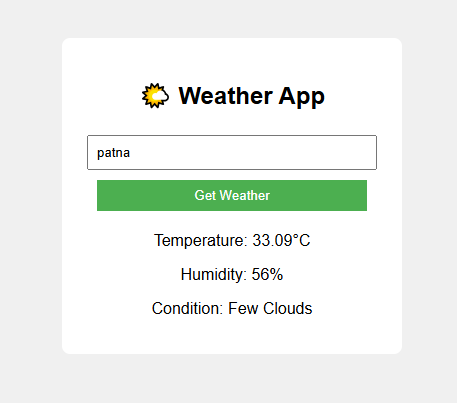

# 🌤 Weather App – Flask + OpenWeatherMap API  

## 📌 Objective  
The objective of this project is to develop a **web-based Weather Application** using **Python Flask** that can display real-time weather details for any city by integrating with the **OpenWeatherMap API**. This project was completed as part of **Task 3** during my Python Development Internship at **Oasis Infobytes**.  

---

## 🔄 Steps Performed  
1. **Set up Flask Project** – Created a Flask application to handle routes and render templates.  
2. **Integrated OpenWeatherMap API** – Registered for an API key and configured API requests to fetch weather data.  
3. **Processed API Response** – Extracted temperature, humidity, and weather conditions from JSON data.  
4. **Built Frontend Template** – Designed an HTML page (`index.html`) for users to input city names and view weather results.  
5. **Tested Functionality** – Verified the app by searching multiple cities and checking for correct real-time data.  

---

## 🛠 Tools & Technologies Used  
- **Python** – Core programming language  
- **Flask** – Web framework for building the application  
- **Requests** – Python library for making API calls  
- **HTML / CSS** – Frontend design for the UI  
- **OpenWeatherMap API** – Source for real-time weather data  

---

## ✅ Outcome  
- Successfully developed a **Weather App** capable of fetching **real-time weather information** for any city worldwide.  
- Displays **temperature (°C)**, **humidity (%)**, and **weather condition** in a clean and user-friendly format.  
- Improved understanding of **REST API integration** and **Flask-based web application development**.  

---

## 📸 Screenshot  
*(Replace `screenshot.png` with your actual file)*  
  

---

## 🚀 How to Run  
1. Clone the repository:  
   ```bash
   git clone https://github.com/your-username/weather-app.git
   cd weather-app
